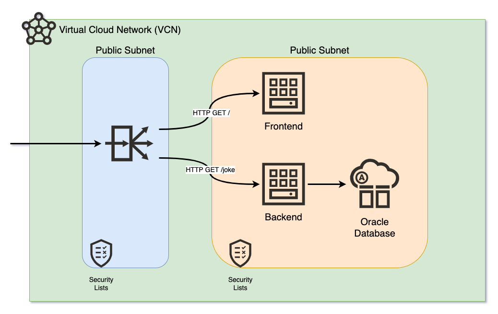

# OCI Frontend and Backend for DevOps

Deploy with Terraform and Ansible your frontend (React.js) and backend (Node.js) on OCI.



## Requirements

- Oracle Cloud Infrastructure account
- OCI CLI, Terraform and Ansible configured.

## TODO

- LB Health Checks in warning
- Frontend and Backend on private subnets
- Add Database

## Set Up

Clone this repository in your local machine:
```
git clone https://github.com/vmleon/oci-fe-be-devops.git
```

Change directory to the `oci-fe-be-devops`:
```
cd oci-fe-be-devops
```

Export an environment variable with the base directory:
```
export BASE_DIR=$(pwd)
```

## Build

Build the frontend static content.

Change directory to the frontend code:
```
cd $BASE_DIR/src/frontend
```

> NOTE: For the next step, make sure you have an up-to-date version of Node.js
> Use `node -v` to check it, is the version >= 14?

Install dependencies:
```
npm install
```

Build the static content:
```
npm run build
```

## Deploy

Change directory to `deploy/terraform`:
```
cd $BASE_DIR/deploy/terraform
```

Authenticate with OCI, it will open a browser where you can log in:
```
oci session authenticate
```

Copy the template for the terraform variables:
```
cp terraform.tfvars.template terraform.tfvars
```

Edit the variables values:
```
vim terraform.tfvars
```

You have to modify:
- `config_file_profile` from the `oci session` command
- `tenancy_ocid` from your OCI tenancy
- `compartment_ocid` the compartment you want, or root compartment (that is the `tenancy_ocid`)
- `ssh_public_key` with your public SSH key, usually in `~/.ssh/id_rsa.pub`

Initialize the terraform provider:
```
terraform init
```

Apply the infrastructure, with auto approval:
```
terraform apply -auto-approve
```

Provision with Ansible:
- NGINX and static content for the frontend
- Node, pm2, code and dependencies for the backend
```
ansible-playbook -i generated/app.ini ../ansible/site.yaml
```

> NOTE: You will be asked a few times:
> `Are you sure you want to continue connecting (yes/no/[fingerprint])?`
> Type `yes` and `[ENTER]`.

Print the load balancer IP from the terraform output again:
```
terraform output lb_public_ip
```

Copy and paste the IP on your browser.

You will see:


Click `GET JOKE` to get a new joke from the backend.

## Clean Up

Destroy all the infrastructure:
```
terraform destroy -auto-approve
```