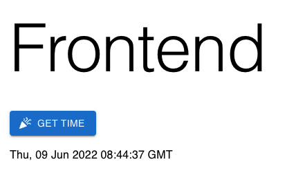

# OCI Frontend and Backend for DevOps

Deploy with Terraform and Ansible your frontend (React.js) and backend (Node.js) on OCI.

## Requirements

- Oracle Cloud Infrastructure account
- OCI CLI, Terraform and Ansible configured.

## TODO

- LB Health Checks in warning
- Frontend and Backend on private subnets
- Add Database

## Set Up

Clone this repository in your local machine:
```
git clone https://github.com/vmleon/oci-fe-be-devops.git
```

Change directory to the `oci-fe-be-devops`:
```
cd oci-fe-be-devops
```

Export an environment variable with the base directory:
```
export BASE_DIR=$(pwd)
```

## Build

Build the frontend static content.

Change directory to the frontend code:
```
cd $BASE_DIR/src/frontend
```

> NOTE: For next step, make sure you have a up-to-date version of Node.js
> Use `node -v` to check it, is the version >= 14?

Install dependencies:
```
npm install
```

```
npm run build
```

## Deploy

```
cd $BASE_DIR/deploy/terraform
```

```
oci session authenticate
```

```
cp terraform.tfvars.template terraform.tfvars
```

Edit the variables values:
```
vim terraform.tfvars
```

```
terraform init
```

```
terraform apply -auto-approve
```

```
ansible-playbook -i generated/app.ini ../ansible/site.yaml
```

> You will be asked a few times:
> `Are you sure you want to continue connecting (yes/no/[fingerprint])?`
> Type `yes` and `[ENTER]`.

Print the load balancer IP from the terraform output again:
```
terraform output lb_public_ip
```

Copy and paste the IP on your browser.

You will see:


## Clean Up

```
terraform destroy -auto-approve
```