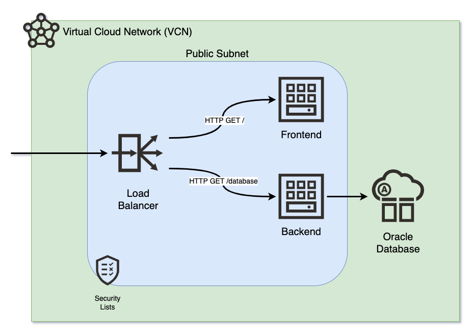

# OCI Frontend and Backend for DevOps

Deploy with Terraform and Ansible your frontend (React.js) and backend (Python Flask) on OCI.



## Requirements

- Oracle Cloud Infrastructure account
- OCI CLI, Terraform and Ansible configured.

## TODO

- LB Health Checks in warning

## Set Up

Clone this repository in your local machine:
```
git clone https://github.com/vmleon/oci-fe-be-devops.git
```

Change directory to the `oci-fe-be-devops`:
```
cd oci-fe-be-devops
```

Export an environment variable with the base directory:
```
export BASE_DIR=$(pwd)
```

## Build

Build the frontend static content.

Change directory to the frontend code:
```
cd $BASE_DIR/src/frontend
```

> NOTE: For the next step, make sure you have an up-to-date version of Node.js
> Use `node -v` to check it, is the version >= 14?

Install dependencies:
```
npm install
```

Build the static content:
```
npm run build
```

## Deploy

Change directory to `deploy/terraform`:
```
cd $BASE_DIR/deploy/terraform
```

> Skip this step for OCI Cloud Shell: 
> Authenticate with OCI, it will open a browser where you can log in:
> ```
> oci session authenticate
> ```

Input the region (Frankfurt by default), and the session name (`DEFAULT` for Cloud Shell).

Terraform will read the values from a file `terraform.tfvars` that you are going to create in the next step.

Use terraform variables template file to create your own `terraform.tfvars`:
```
cp terraform.tfvars.template terraform.tfvars
```

Edit the variables values with vim or your favorite editor:
```
vim terraform.tfvars
```

The values goes in this file `terraform.tfvars` and contains: profile, tenancy, compartment and ssh key.

### Profile

The `config_file_profile` is `DEFAULT` if you are using OCI Cloud Shell.

But if you use `oci session authenticate` (not for OCI Cloud Shell) you might have specify a different value, change it in that case.

### Tenancy

The `tenancy_ocid` value comes from the account tenancy OCID, get the value with the following command:

```
echo $OCI_TENANCY
```

### Compartment

For testing, you can use the root compartment, what is the tenancy OCID from the previous step.

Sometimes, you want a specific compartment. To get the compartment OCID you can run a search with the following command:

> Replace `NAME_TO_FIND` for the name of the compartment
```
oci iam compartment list \
  --compartment-id-in-subtree true \
  --name NAME_TO_FIND | jq .data
```

### SSH Public key

The `ssh_public_key` is for your public SSH key, you can copy the result of:
```
cat ~/.ssh/id_rsa.pub
```

> Do you have an SSH key pair, if not, run the following command:
> ```
> ssh-keygen -b 2048 -t rsa
> ```
> Then, you can copy the result of: `cat ~/.ssh/id_rsa.pub`

### Terraform

Initialize the terraform provider:
```
terraform init
```

Plan the infrastructure:
```
terraform plan -out resources.tfplan
```

Apply the infrastructure, with auto approval:
```
terraform apply resources.tfplan
```

Answer by typing `yes` when terraform asks you to confirm.

> Curious about what it looks like? Terraform can generate a graph.
> 
> Generate the graph of resources created:
> ```
> terraform graph
> ```

### Ansible

Ansible SSH into the machines and provision everything needed for the machines to host the applications:
- Frontend: NGINX and static content for the frontend
- Backend: Python app as Systemd Service and database parameters

Run the Ansible Playbook:
```
ansible-playbook -i generated/app.ini \
  ../ansible/site.yaml \
  --extra-vars "@generated/backend_params.json"
```

> NOTE: You will be asked a few times:
> `Are you sure you want to continue connecting (yes/no/[fingerprint])?`
> Type `yes` and `[ENTER]`.

Print the load balancer IP from the terraform output again:
```
terraform output lb_public_ip
```

Copy and paste the IP on your browser.

You will see:


Click `GET TIME` to get a date from the backend, that will ask the database.

## Clean Up

Destroy all the infrastructure:
```
terraform destroy -auto-approve
```